# GUINDO BADARA ALIOU MSDIA FSM
### MASSAR 2100000017

# TP 3 PARTIE 2


## Introduction
Dans le cadre de ce projet, nous avons mis en place un système complet d'authentification et d'autorisation basé sur Spring Security au sein d'une application développée avec Spring Boot.
L'objectif principal était de sécuriser l'accès aux différentes fonctionnalités de l'application selon les rôles des utilisateurs (USER, ADMIN), tout en assurant une expérience utilisateur fluide grâce à des interfaces personnalisées.

Ce rapport retrace l'ensemble des étapes réalisées : ajout des dépendances, configuration de la sécurité en mémoire et via base de données, création des entités utilisateur/rôle, personnalisation des pages (login, erreur 403, profil), ainsi que la mise en œuvre d'une sécurité fine au niveau des méthodes grâce aux annotations @PreAuthorize.
### Ajout des dépendances

On commence par ajouter les dépendances de Spring Security :

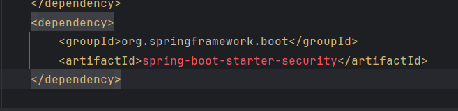

### Authentification par défaut

Une authentification par défaut est disponible dès le lancement de l'application :

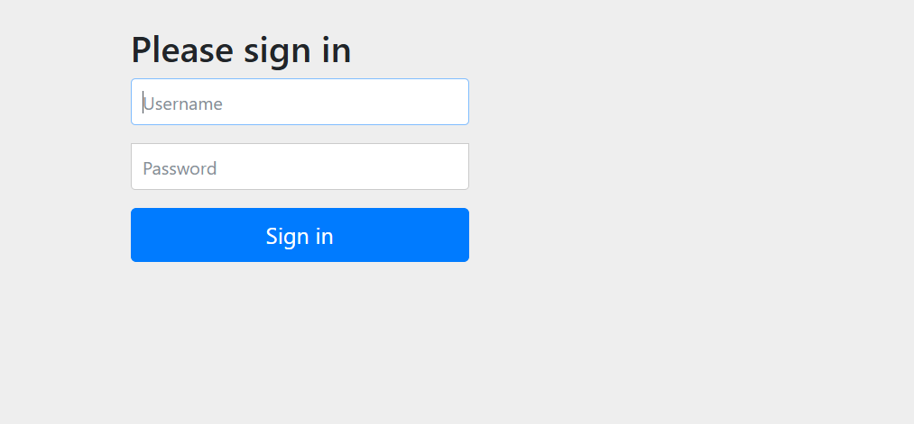

### Authentification en mémoire

Cette méthode configure une authentification en mémoire avec trois utilisateurs : `user1`, `user2` et `admin`.  
Les mots de passe sont encodés en clair avec `{noop}` pour faciliter les tests.  
Chaque utilisateur possède un ou plusieurs rôles : `user1` et `user2` ont le rôle `USER`, tandis que `admin` a les rôles `USER` et `ADMIN`.  
Cette configuration est pratique pour tester la sécurité sans base de données.

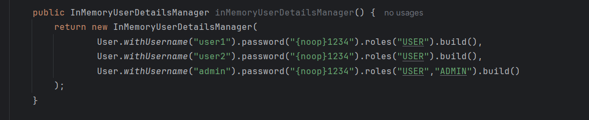

### Configuration du PasswordEncoder

Cette méthode définit un bean `PasswordEncoder` utilisant l’algorithme **BCrypt**, recommandé pour encoder les mots de passe de manière sécurisée.  
Grâce à cette configuration, Spring Security peut **hacher les mots de passe** lors de l'enregistrement et les **vérifier correctement à la connexion**.  
C’est bien plus sécurisé que l'encodage en clair (`{noop}`).

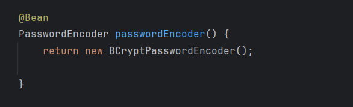

### Utilisation de BCrypt dans l’authentification en mémoire

Ici, on configure l’authentification en mémoire avec trois utilisateurs dont les mots de passe sont **encodés avec BCrypt**, via le bean `PasswordEncoder` injecté avec `@Autowired`.  
Les rôles (`USER`, `ADMIN`) seront utilisés pour gérer l'accès à différentes parties de l'application.

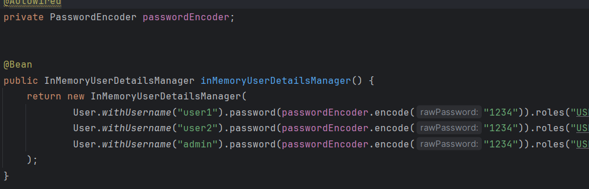

### Affichage du nom d'utilisateur connecté

Maintenant, on affiche le nom de l'utilisateur connecté :

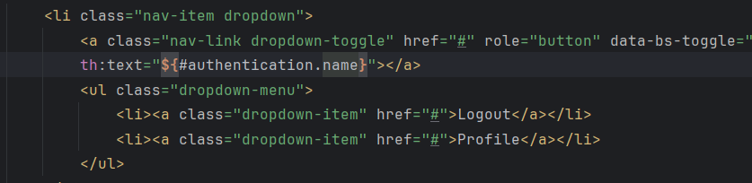

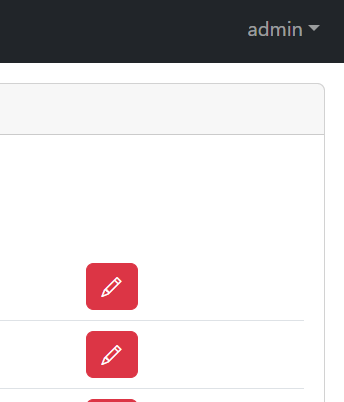

### Ajout d’un bouton de déconnexion (Logout)

On a ajouté un bouton "Logout" directement dans la page :

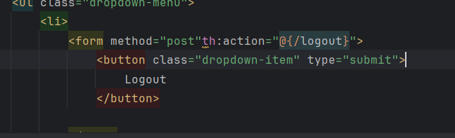

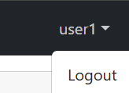

### Redirection vers une page d’accueil

La méthode annotée avec `@GetMapping("/")` gère les requêtes vers la racine de l’application (`http://localhost:8087/`).  
Elle redirige automatiquement vers `/index`, la page principale affichant la liste des patients.  
Cela assure une navigation fluide dès l’accès à l’application.

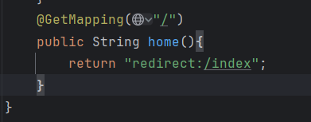

### Restriction des fonctionnalités selon le rôle

On a supprimé les fonctionnalités "Supprimer", "Modifier" et "Ajouter" pour les utilisateurs avec le rôle `USER`.  
Seuls les administrateurs peuvent y accéder.  
Dans les pages HTML, ces options ne sont affichées qu'aux administrateurs (ex. : "Delete").

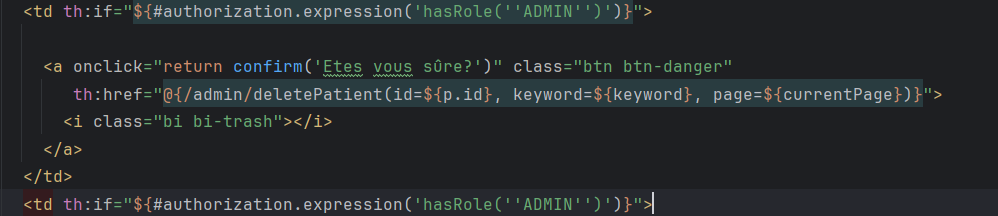

#### Résultat avec un utilisateur classique :

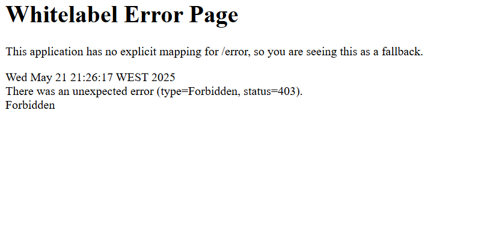

### Page personnalisée pour les erreurs 403

On crée une page personnalisée pour éviter d'afficher la page d'erreur 403 par défaut :

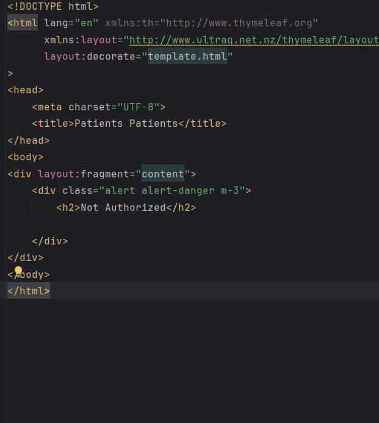

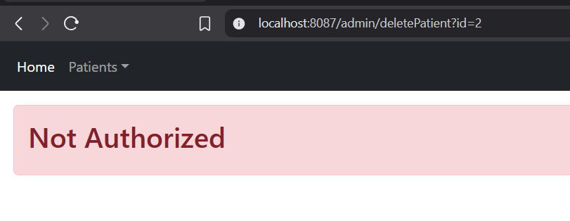

### Page de login personnalisée

On personnalise la page de login :

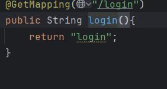


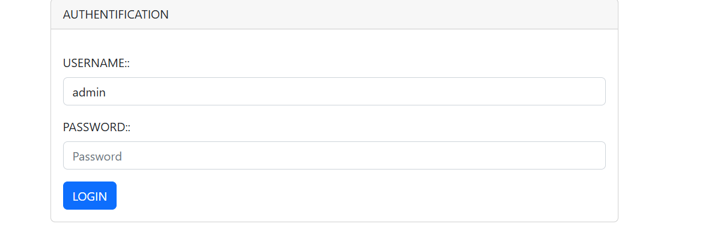

### Ajout d’une option "Remember Me"


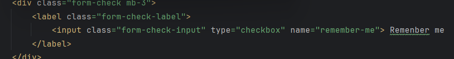

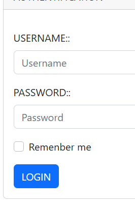

### Activation des sécurités au niveau des méthodes

On ajoute l’annotation `@EnableMethodSecurity(prePostEnabled = true)` dans la classe de configuration de sécurité pour activer la gestion fine des autorisations avec `@PreAuthorize` et `@PostAuthorize`.

Pour sécuriser les méthodes réservées aux administrateurs, on utilise `@PreAuthorize("hasRole('ROLE_ADMIN')")`.  
Cela garantit que seules les personnes ayant le rôle `ADMIN` peuvent exécuter ces méthodes.

---

### Authentification JDBC

Deux tables sont créées dans la base de données pour gérer les utilisateurs et leurs rôles :

- La table **users** : contient le nom d’utilisateur, mot de passe encodé, et un indicateur d’activation du compte.
- La table **authorities** : contient les rôles (`USER`, `ADMIN`) associés à chaque utilisateur, liés par une clé étrangère.

Un index unique empêche qu’un même rôle soit attribué plusieurs fois à un utilisateur.

Le bean **JdbcUserDetailsManager** permet d’utiliser cette base pour authentifier les utilisateurs.

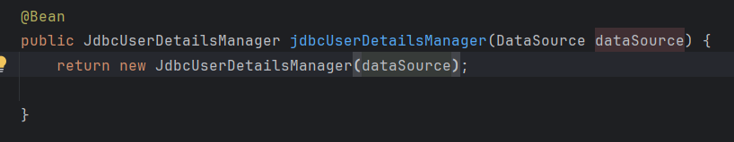

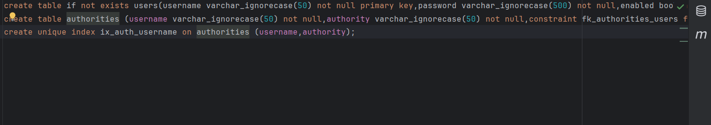

#### Propriétés Spring Boot

```properties
spring.jpa.defer-datasource-initialization=true
spring.sql.init.mode=always
```

- Retarde l’exécution des scripts SQL jusqu’à ce que JPA soit prêt.
- Exécute les scripts SQL à chaque démarrage.


Les utilisateurs sont ajoutés directement dans la base au démarrage via `JdbcUserDetailsManager`.  
Cela permet de préconfigurer des comptes sans intervention manuelle.

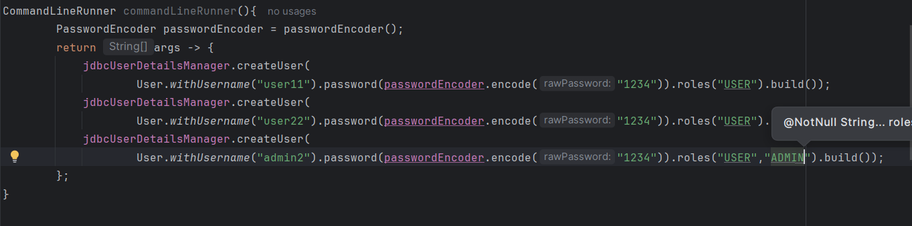

---

### UserDetails Service personnalisé

On a créé deux entités JPA : `AppUser` et `AppRole`.

- `AppUser` : représente un utilisateur (id, username, password, email, rôles).
- `AppRole` : représente un rôle (`USER`, `ADMIN`).

Relation `ManyToMany` entre les deux : un utilisateur peut avoir plusieurs rôles, et un rôle peut être partagé.

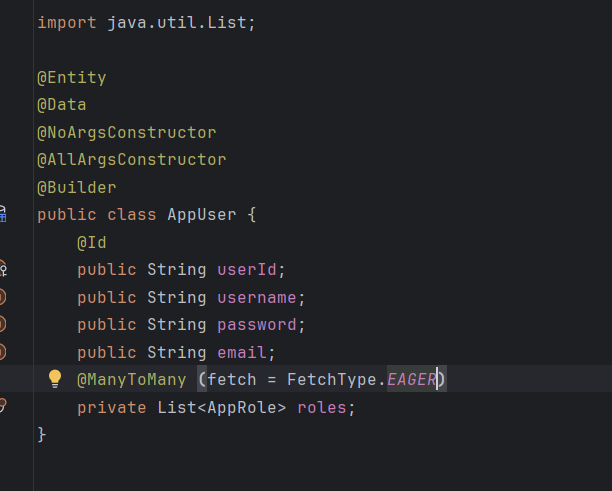

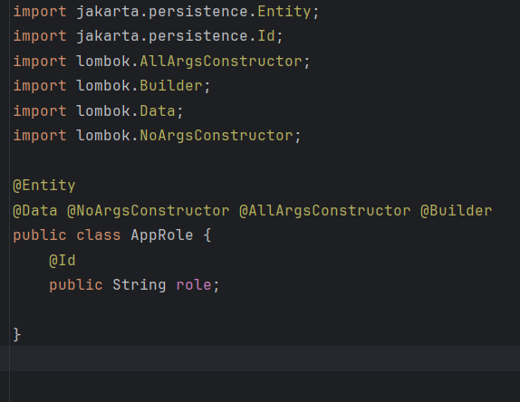

---

### Interface AccountService

On a créé une interface `AccountService` définissant les opérations de gestion des utilisateurs et rôles :

- `addNewUser`
- `addNewRole`
- `addRoleToUser`
- `removeRoleFromUser`

Ces méthodes seront implémentées dans une classe de service pour centraliser la gestion.

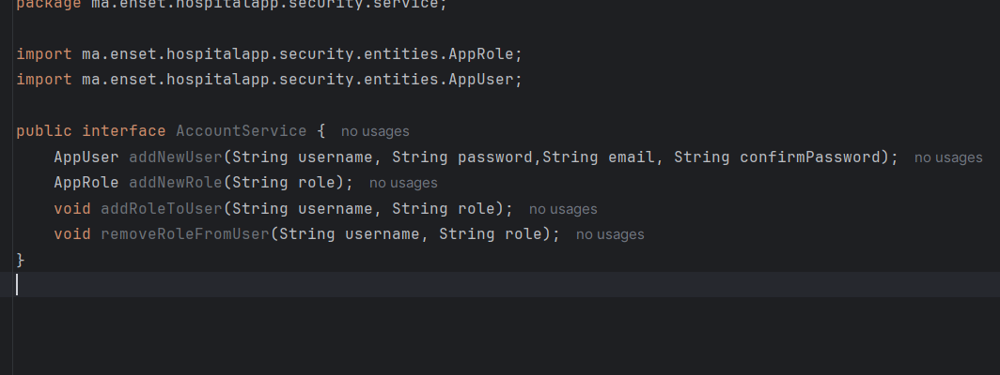

---

### Implémentation dans AccountServiceImpl

La classe `AccountServiceImpl`, annotée avec `@Service` et `@Transactional`, implémente `AccountService`.  
Elle utilise `AppUserRepository`, `AppRoleRepository` et `PasswordEncoder`.

Fonctionnalités :

- `addNewUser` : vérifie l’existence, encode le mot de passe, puis sauvegarde.
- `addNewRole` : ajoute un rôle s’il n’existe pas déjà.
- `addRoleToUser` : associe un rôle à un utilisateur.
- `removeRoleFromUser` : retire un rôle.
- `loadUserByUsername` : recherche un utilisateur (pour l’authentification).

> Ensuite, on a créé une méthode `commandLineRunnerUserDetails` annotée avec `@Bean` pour initialiser les données au démarrage :

- Ajout des rôles `USER` et `ADMIN`.
- Création de trois utilisateurs.
- Attribution des rôles :
    - `user1` et `user2` → `USER`
    - `admin` → `USER`, `ADMIN`

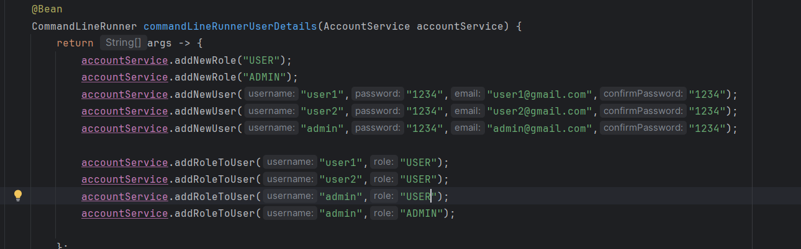

---

### Implémentation de UserDetailsService

`UserDetailServiceImpl` implémente `UserDetailsService`.  
La méthode `loadUserByUsername` utilise `AccountService` pour récupérer un `AppUser`, puis construit un `UserDetails` exploité par Spring Security.

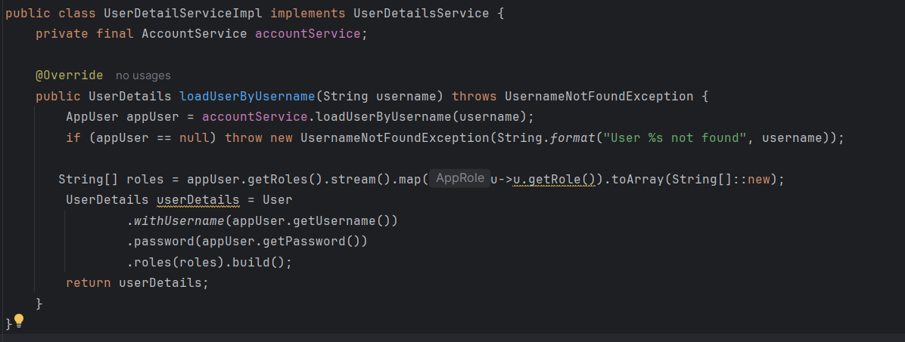

---

### Ajout d’un bouton "Profil"

On ajoute un bouton menant vers le profil utilisateur :


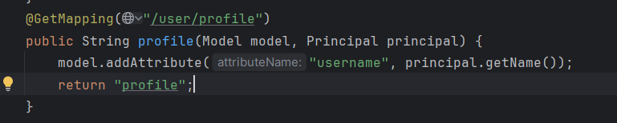

### Page de profil HTML

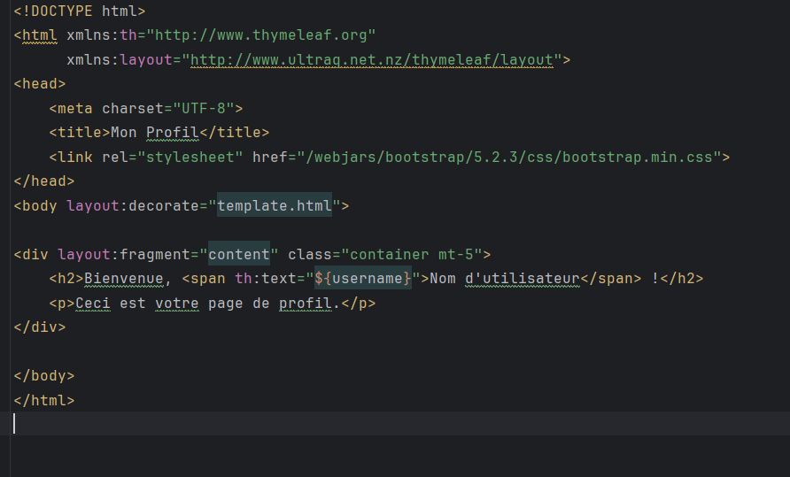

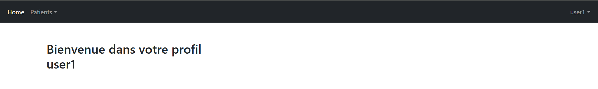
## Conclusion
Ce projet nous a permis de maîtriser les fonctionnalités essentielles de Spring Security pour protéger une application Spring Boot.
Grâce à l’implémentation progressive — de l’authentification en mémoire jusqu'à l'intégration avec une base de données relationnelle — nous avons mis en place un système de sécurité robuste, extensible et conforme aux bonnes pratiques.

La séparation des rôles, le hachage des mots de passe avec BCrypt, ainsi que la personnalisation des interfaces utilisateur ont contribué à améliorer à la fois la sécurité et l’ergonomie de l’application.

Ce travail constitue une base solide pour tout projet nécessitant un contrôle d’accès fiable et modulaire.